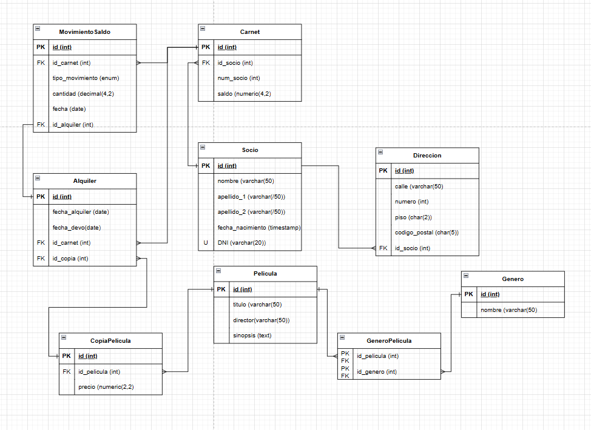

# Proyecto de Modelado SQL

## Descripción del Proyecto

El objetivo de este proyecto es diseñar y crear una base de datos que cumpla con los siguientes requisitos: 

- Necesito registrar los socios del videoclub. Al menos necesito su nombre y apellidos,
fecha de nacimiento, teléfono y su número de identificación (DNI, Pasaporte, o el nombre
que reciba en tu país) y nosotros le asignaremos un número de socio que usaremos para
hacer carnets (definitivamente tu primo se quedo en algún momento de los 90’s ).
- Necesito registrar la dirección de correspondencia de los socios para, eventualmente,
hacer campañas de publicidad, pero no es un requisito obligatorio que un socio nos de
esa información. Con el código postal, calle, número y piso es suficiente,
sobreentendemos que será de la misma ciudad donde esta el videoclub.
- Necesito registrar las películas. Puedo tener más de una copia de cada una. De cada
película necesito registrar el título, género, director y sinopsis.
- Necesito saber a que socio le he prestado cada copia y cuando. Es decir, registrar la
fecha en la que se la ha llevado y la fecha de la devolución. Cuando una película no tiene
fecha de devolución, la consideramos prestada.
- Para ir tirando, necesito consultar a menudo que películas están disponibles para
alquilar en este momento (no están prestadas). Necesito saber el título de la película y el
número de copias disponibles

## Diagrama de Entidad-Relación

## Licencia

Este proyecto está bajo la Licencia MIT.

## Contacto

Para cualquier consulta o sugerencia, por favor contacta a [oscar.caasmontes@gmail.com](mailto:oscar.caasmontes@gmail.com).
